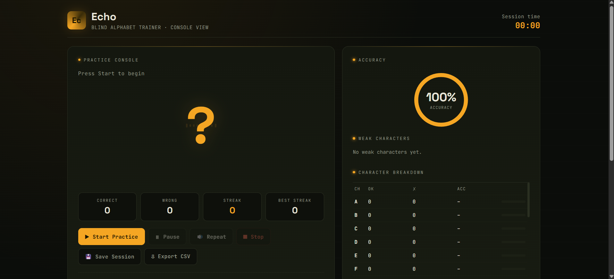
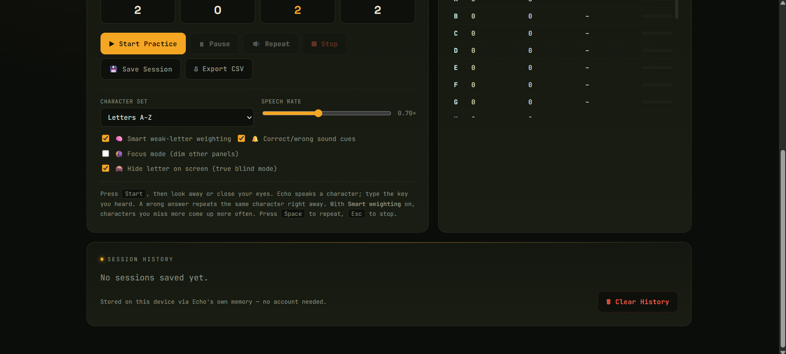

# 🔊 ECHO — Blind Alphabet Trainer

A focused **browser-based alphabet typing trainer** designed to help users practice letter recognition and keyboard accuracy through **voice-guided learning, real-time feedback, and performance tracking**.

ECHO combines typing practice with audio guidance to create a more interactive and accessible way to improve alphabet familiarity and keyboard confidence.

🔗 **[ECHO — Live Project Demo](https://princebuildsai.github.io/ECHO-SITE/)**

## 📸 Project Overview

<table align="center"> <tr> <td style="border: 2px solid #00aaff; border-radius: 12px; padding: 6px;">  </td> <td style="border: 2px solid #00aaff; border-radius: 12px; padding: 6px;">  </td> </tr> </table>

---
## ⚡ Project Highlights

| 🚀 Specification            |           📊 Details |
| --------------------------- | -------------------: |
| 🔤 Alphabet Training        | **A–Z (26 Letters)** |
| 🔢 Number Training          |  **0–9 (10 Digits)** |
| 🎙️ Voice-Guided Practice   |              **Yes** |
| ⌨️ Keyboard Interaction     |        **Real-Time** |
| 🎯 Accuracy Tracking        |        **Real-Time** |
| 🔥 Streak Tracking          |              **Yes** |
| 🧠 Weak Character Detection |              **Yes** |
| 📊 Character Analytics      |        **Real-Time** |
| 💾 Session Saving           |              **Yes** |
| 📁 Data Export              |              **CSV** |
| 🌙 Interface                |       **Dark Theme** |
| 🌐 Deployment               |     **GitHub Pages** |

---

## 🔤🔢 Alphabet & Number Training

ECHO is not limited to alphabet practice. It also provides **number training**, allowing users to practice both letters and digits through voice-guided typing.

### 🔤 Alphabet Training

Practice all **26 English alphabet characters**:

```text
A  B  C  D  E  F  G
H  I  J  K  L  M  N
O  P  Q  R  S  T  U
V  W  X  Y  Z
```

### 🔢 Number Training

Practice all **10 digits**:

```text
0  1  2  3  4
5  6  7  8  9
```

Users can select the desired character set and practice according to their learning needs.

---

## 🎯 Smart Practice Modes

ECHO provides configurable practice options to make training more effective:

* 🔤 **Letters A–Z**
* 🔢 **Numbers 0–9**
* 🧠 **Smart Weak-Letter Weighting**
* 🔊 **Correct/Wrong Sound Cues**
* 👁️ **True Blind Mode**
* 🎚️ **Adjustable Speech Rate**
* 🎯 **Focus Mode**

The **Smart Weak-Letter Weighting** feature can give more practice opportunities to characters that the user frequently misses.

---

## 📊 Project Scale

<p align="center">

### 🔤 **26 Letters + 🔢 10 Digits**

Complete alphabet and number training coverage.

### 🎙️ **Voice-Guided Practice**

Hear the target character and type it without relying entirely on visual prompts.

### 🧠 **Smart Weak-Character Training**

Characters with more mistakes can receive additional practice.

### 📈 **Real-Time Performance Tracking**

Accuracy, mistakes, streaks, session time, and character-level performance are tracked during practice.

</p>

---

## 🎯 Project Objective

ECHO is designed to provide a **complete blind typing practice environment** for both letters and numbers.

The system combines:

**Voice Guidance + Keyboard Practice + Smart Repetition + Performance Analytics**

to help users improve their typing accuracy, character recognition, and confidence while typing without constantly looking at the screen.


## 🎯 What is ECHO?

ECHO is a **Blind Alphabet Trainer** built to make alphabet typing practice more engaging through voice-based interaction.

Instead of simply displaying a letter and asking the user to type it, ECHO creates a practice environment where users can:

* 🎙️ Hear the target letter
* ⌨️ Type the corresponding key
* ⚡ Receive instant feedback
* 📊 Monitor accuracy
* 🔥 Build typing streaks
* 🧠 Identify weak characters
* 💾 Save practice sessions
* 📁 Export performance data

---

## 🔤 26-Letter Training System

ECHO covers the complete English alphabet:

```text
A  B  C  D  E  F  G
H  I  J  K  L  M  N
O  P  Q  R  S  T  U
V  W  X  Y  Z
```

Each character can be individually tracked to help identify which letters require more practice.

---

## 🎙️ Voice-Guided Learning

ECHO uses voice feedback to make typing practice more interactive.

The system can:

* 🔊 Pronounce the target character
* 🔁 Repeat the pronunciation when requested
* ⚡ Move to the next character after correct input
* 🎧 Provide an audio-based learning experience

This makes ECHO particularly useful for users who want to practice without constantly looking at the screen.

---

## 📊 Real-Time Performance Tracking

ECHO continuously tracks the user's performance during a practice session.

### 📈 Tracked Metrics

* ✅ Correct attempts
* ❌ Incorrect attempts
* 🎯 Accuracy percentage
* 🔥 Current streak
* 🏆 Best streak
* 🧠 Weak characters
* ⏱️ Session duration
* 📊 Character-by-character performance

---

## 🧠 Character Intelligence

One of ECHO's key features is its **character-level performance tracking**.

Instead of showing only an overall score, the system can analyze individual letters and identify characters where the user makes more mistakes.

```text
Character
    ↓
Correct Attempts
    ↓
Wrong Attempts
    ↓
Accuracy
    ↓
Performance Analysis
    ↓
Weak Character Detection
```

This helps users understand **which letters need additional practice**.

---

## 💾 Session Management

ECHO provides session management features that allow users to preserve and review their practice activity.

### Available Options

* 💾 **Save Session**
* 📁 **Export CSV**
* ⏱️ **Session Time Tracking**
* 📊 **Performance Records**

The CSV export feature makes it possible to take practice data outside the application for further analysis.

---

## ⚡ Practice Controls

ECHO includes simple controls for managing a practice session:

| Control           | Purpose                    |
| ----------------- | -------------------------- |
| ▶️ Start Practice | Begin a typing session     |
| ⏸️ Pause          | Temporarily pause practice |
| 🔊 Repeat         | Repeat the current letter  |
| ⏹️ Stop           | End the current session    |
| 💾 Save Session   | Store session performance  |
| 📁 Export CSV     | Export performance data    |

---

## 🔄 How ECHO Works

```text
🎙️ Target Letter
       ↓
🔊 Voice Pronunciation
       ↓
⌨️ User Types Letter
       ↓
⚡ Instant Validation
       ↓
📊 Update Statistics
       ↓
🔥 Update Streak
       ↓
🧠 Analyze Character Performance
       ↓
➡️ Next Letter
```

---

## 🛠️ Tech Stack

### 🌐 Frontend

* HTML5
* CSS3
* JavaScript

### 🎙️ Browser Features

* Web Speech API
* Keyboard Events
* Browser Audio / Speech Capabilities
* Local Browser Storage

### 📊 Data Handling

* JavaScript-based session tracking
* CSV data export
* Character-level statistics

### 🚀 Deployment

* GitHub Pages

---

## 💡 Key Features

### 🎙️ Voice-Based Practice

Hear the target character instead of relying only on visual prompts.

### ⌨️ Instant Keyboard Feedback

The application immediately detects whether the entered key is correct or incorrect.

### 🎯 Accuracy Monitoring

Track overall typing accuracy throughout the session.

### 🔥 Streak System

Build consecutive correct answers and monitor your best performance.

### 🧠 Weak Character Detection

Identify letters that require additional practice.

### 📊 Character Breakdown

View individual performance statistics for all **26 alphabet characters**.

### 💾 Session History

Save completed practice sessions for future reference.

### 📁 CSV Export

Export practice data for external analysis and record keeping.

---

## 📌 Project Scale

<p align="center">

### 🔤 **26 Alphabet Characters**

Complete A–Z coverage with individual character-level performance tracking.

### 🎙️ **Voice-Guided Learning**

Audio-based pronunciation combined with keyboard interaction.

### 📊 **Real-Time Analytics**

Accuracy, mistakes, streaks, session time, and character performance are tracked during practice.

</p>

---

## 🎯 Project Objective

The main objective of ECHO is to create a simple but intelligent typing practice environment that combines:

**Voice Interaction + Keyboard Practice + Real-Time Analytics**

Rather than being just a typing test, ECHO focuses on helping users understand **where they make mistakes and which characters need more practice**.

---

## 🚀 Why This Project Matters

ECHO demonstrates how modern browser capabilities can be combined to create an interactive learning tool without requiring a complex backend.

The project brings together:

**Frontend Development + Browser APIs + Voice Interaction + Real-Time Data Tracking + User Experience**

into a single practical application.

---

## 🔮 Future Improvements

* 📈 Advanced performance dashboards
* 🏆 Leaderboard and achievement system
* 📅 Long-term progress tracking
* 🎯 Personalized practice based on weak characters
* 🔊 Multiple voice and pronunciation options
* 📱 Improved mobile responsiveness
* 🌍 Multi-language voice support
* 📊 Detailed historical analytics
* 🎮 Gamified typing challenges

---

## 🎯 Skills Demonstrated

**HTML • CSS • JavaScript • Web Speech API • Browser APIs • Voice Interaction • Event Handling • Data Tracking • CSV Export • UI/UX • Responsive Web Design • GitHub Pages**

---

## 👨‍💻 Author

**PrinceBuildsAI**

Built as a practical **web-based learning project** to explore how voice interaction, real-time typing feedback, and performance analytics can be combined to create a smarter and more engaging alphabet training experience.

---

⭐ **If you found this project interesting, consider giving the repository a star!**
